# BidReady KSA PRD and Implementation Plan

## Executive summary

BidReady KSA should be built as a **Saudi bid-readiness operating system**, not just a tender-alert dashboard and not a generic proposal writer. The official Saudi procurement flow already has a formal digital backbone through Etimad: government tenders can be offered, purchased, submitted, examined, technically evaluated, and awarded through the platform, and the private sector can view tenders, receive invitations, buy tender documents, and submit bids electronically. That means the strongest product wedge is the operational layer around the official submission process: intake, qualification, requirement extraction, document readiness, compliance tracking, task orchestration, and exportable bid packs. citeturn13view5turn17view1turn17view0turn17view4

The product should be **sector-configurable**, not sector-limited. Construction, facilities, technology, consulting, medical supply, logistics, and services can all run on one shared workflow if the system uses sector packs for scoring, evidence templates, recurring requirement patterns, and response guidance. Competitor pages make the market shape clear: Tenders Alerts focuses on search, alerts, archive, awards, BOQ search, exports, and API access, while Esdaar focuses more deeply on discovery, proposal writing, compliance checking, bilingual operation, and enterprise/on-premise deployments. That leaves room for a product centered on the missing middle: **bid-readiness operations**. citeturn14view2turn13view3turn15view1turn15view2turn14view6

Security and privacy are not optional product extras in Saudi Arabia. SDAIA’s PDPL materials and implementing-regulation details require purpose limitation, minimization, retention discipline, destruction of unnecessary data, records of processing activities, breach notification workflows, and impact assessment in certain higher-risk cases. Cross-border transfer also requires safeguards, and DPO responsibilities are formally defined where appointment conditions are met. BidReady KSA therefore needs auditability, tenant isolation, sensitivity-based access, configurable retention, and “human review with provenance” rather than opaque automation. citeturn17view2turn19view0turn19view1turn19view2turn19view3

Commercially, the best launch is **managed SaaS first**, then scaled self-serve. Current Saudi competitors publish entry pricing in the low hundreds of SAR per month, but they also show that customers will pay for this category. A differentiated readiness layer can price above pure alerting if it materially reduces submission chaos, disqualification risk, and labor cost. citeturn15view0turn15view1

## Product Requirements Document

### Product definition

**Product name:** BidReady KSA  
**Market:** Saudi Arabia  
**Positioning:** Arabic-first, sector-configurable bid-readiness workspace for government and institutional tenders  
**Primary outcome:** turn a tender from “found” into “submission-ready” with provable traceability

**Problem statement**

Saudi suppliers do not mainly fail because they cannot *find* tenders. They fail because the response work after discovery is fragmented across portals, PDFs, email threads, spreadsheets, shared drives, and expiring company documents. Official Etimad materials confirm the structured procurement lifecycle and electronic private-sector participation, which makes this fragmentation especially productizable. citeturn13view5turn17view1turn17view4

**Product goals**

| Goal | Success indicator |
|---|---|
| Reduce tender triage time | First fit-score view in under 30 minutes for standard RFPs |
| Reduce administrative disqualification risk | Visibility of all critical missing/expired evidence before export gate |
| Reuse company evidence across bids | More than half of matrix evidence linked from vault by month three |
| Support Saudi working style | Arabic-first UI, SAR currency, Hijri/Gregorian normalization |
| Create defensible enterprise path | Sovereign-hosting and on-prem readiness in later phases |

**Scope**

| In scope for MVP | Out of scope for MVP |
|---|---|
| Tender intake from upload, email forwarding, link capture, and authorized adapters | Autonomous final bid submission into Etimad |
| Arabic/English summaries and requirement extraction | Automated pricing strategy engine |
| Bid/no-bid scoring with explainable factors | Legal advice engine |
| Compliance matrix and evidence matching | Deep ERP replacement |
| Document vault, expiry tracking, reminders | Full on-prem for day-one SaaS |
| Submission-readiness exports | Unreviewed AI-only output |

### Personas and jobs to be done

| Persona | Core job | What BidReady must do |
|---|---|---|
| Owner / GM | Decide where bid capacity should go | Show pipeline value, strategic rejects, readiness risk |
| Bid Manager | Operate the bid process under deadline pressure | Provide fit score, requirement map, matrix, ownership, gatekeeping |
| Presales / Technical Lead | Decode technical scope fast | Surface technical requirements with source references |
| Finance / Admin | Maintain valid legal and financial evidence | Track expiry, missing items, guarantee dependencies |
| Document Controller | Prevent version confusion | Make one approved evidence vault the source of truth |
| Reviewer / Partner | Review quickly without over-access | Give least-privilege tender-specific access |

### User journeys

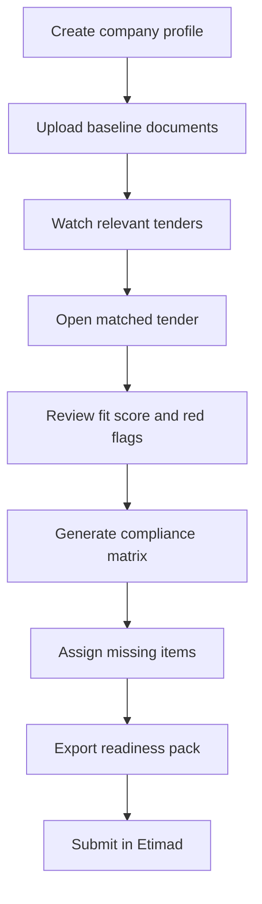

**Primary journey**

A company profile is set up once. Baseline documents are uploaded once and renewed over time. Every new tender enters a shared workspace, is parsed, scored, reviewed, and converted into a gap-driven compliance matrix. The matrix then drives owners, reminders, and export packs until the team is ready for submission in the official channel. That structure is consistent with the official e-procurement model and with how competitors describe the surrounding work users are trying to simplify. citeturn13view5turn17view1turn15view2turn13view3

### Functional requirements

| Capability | Requirement | Priority |
|---|---|---|
| Tender intake | Upload files, ingest emails, capture links, create manual tender records | Must |
| Tender parsing | Extract metadata, deadlines, requirements, languages, attachments, confidence | Must |
| Bid/no-bid | Score fit using capability, timing, evidence availability, sector-pack logic, risk | Must |
| Compliance matrix | Generate editable, versioned requirement-to-evidence matrix | Must |
| Document vault | Store reusable documents with sensitivity, expiry, retention, and links | Must |
| Tasks and reminders | Create tasks from missing evidence and nearing deadlines | Must |
| Exports | Produce readiness PDF/Excel/ZIP packs | Must |
| Search | Filter by sector, entity, region, status, risk, tags | Should |
| Reporting | Dashboard of open tenders, risk, expiring docs, outcomes | Should |
| Webhooks / APIs | Surface ingestion status, document status, task events | Should |

### Non-functional requirements

| Category | Requirement |
|---|---|
| Availability | Pilot SaaS target 99.5% monthly |
| Performance | P95 dashboard < 2s; matrix generation async with progress |
| Localization | Arabic-first RTL plus English parity |
| Auditability | Immutable records for approvals, exports, sensitive reads, config changes |
| Isolation | Tenant-level separation for metadata and objects |
| Explainability | Every extracted requirement stores source anchor and confidence |
| Security | Encryption in transit and at rest, RBAC, environment segregation |
| Recovery | Pilot target RPO ≤ 15 min, RTO ≤ 4 hours |
| Accessibility | Keyboard-safe, high-contrast core workflows |

### Data model

At minimum, the core entities should be:

- **Organization**
- **User**
- **ClientCompany**
- **Tender**
- **TenderAttachment**
- **TenderRequirement**
- **ComplianceMatrix**
- **ComplianceItem**
- **ClientDocument**
- **EvidenceLink**
- **Task**
- **SubmissionPack**

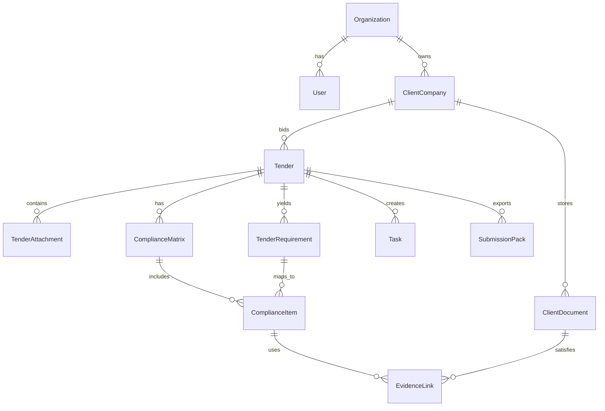

### Annotated wireframes

**Dashboard**

```text
+-----------------------------------------------------------------------------------+
| KPI strip: Open tenders | Bid-ready | Critical gaps | Docs expiring               |
+-------------------+---------------------------------------------------------------+
| Sidebar           | Tender feed with fit score, deadline, entity, status          |
| - Dashboard       |                                                               |
| - Tender Feed     |                                                               |
| - My Bids         |                                                               |
| - Compliance      |                                                               |
| - Documents       |                                                               |
| - Tasks           |---------------------------------------------------------------|
| - Exports         | Critical tasks rail                | Document expiry radar     |
+-------------------+------------------------------------+--------------------------+
Annotations:
[1] KPI strip updates in under 2s.
[2] Tender feed is the main decision surface.
[3] Task rail shows only submission-critical actions.
[4] Expiry radar prevents hidden disqualification triggers.
```

**Tender workspace**

```text
+-----------------------------------------------------------------------------------+
| Tender summary | Entity | Sector | Status | normalized deadlines                  |
+-----------------------------------------------------------------------------------+
| Summary text and key facts                                                        |
+-----------------------------------------------------------------------------------+
| Detected requirements table with category, source ref, confidence                 |
+----------------------------------------------------+------------------------------+
| Attachments and parse status                        | Bid/no-bid panel             |
|                                                    | Fit score + reasons          |
+----------------------------------------------------+------------------------------+
Annotations:
[1] Deadline strip must preserve original source text plus normalized operational date.
[2] Requirement rows must keep provenance.
[3] Fit score must be explainable and overridable.
[4] Attachment states must block silent failures.
```

**Compliance matrix**

```text
+------------------------------------------------------------------------------------------------+
| Req | Category | Evidence | Owner | Due | Risk | Status                                         |
+------------------------------------------------------------------------------------------------+
| CR & Zakat | Admin | linked docs | Finance | 22 May | High | Partial                           |
| Bid bond   | Financial | none     | Finance | 24 May | Critical | Missing                        |
| OEM auth   | Technical | pending  | Procurement | 23 May | High | Missing                        |
+------------------------------------------------------------------------------------------------+
Annotations:
[1] Evidence linkage is mandatory.
[2] Owner and due date turn extraction into execution.
[3] Critical rows block readiness export unless explicitly overridden.
```

**Document vault**

```text
+------------------------------------------------------------------------------------------------+
| Document | Type | Sensitivity | Expiry | Linked tenders | Retention | State                      |
+------------------------------------------------------------------------------------------------+
| CR       | Legal | Low        | 31 Jul | 48             | Contract+2y | Active                    |
| Zakat    | Compliance | Med   | 14 Jun | 21             | Contract+2y | Expiring                  |
| CV bundle| Personal | High    | --     | 9              | Bid+1y       | Restricted                |
+------------------------------------------------------------------------------------------------+
Lifecycle:
Upload -> Scan -> Classify -> Approve -> Use -> Remind -> Archive/Destroy
Annotations:
[1] Sensitivity drives access and masking.
[2] Retention/destruction is a real workflow, not a background assumption.
```

### API contracts

**Core endpoints**

| Method | Endpoint | Purpose |
|---|---|---|
| POST | `/v1/ingestions` | Create intake job |
| GET | `/v1/ingestions/{id}` | Return parse progress and warnings |
| GET | `/v1/tenders/{id}/workspace` | Full workspace bundle |
| POST | `/v1/tenders/{id}/fit-score/recompute` | Recalculate fit score |
| POST | `/v1/tenders/{id}/compliance-matrices` | Generate/version matrix |
| PATCH | `/v1/compliance-items/{id}` | Update row state |
| POST | `/v1/documents` | Upload/classify document |
| POST | `/v1/tasks` | Create remediation tasks |
| POST | `/v1/exports/submission-pack` | Build readiness pack |
| POST | `/v1/webhooks/inbound/email` | Inbound email ingestion |
| POST | `/v1/webhooks/whatsapp/status` | Delivery status callback |

**Example**

```json
POST /v1/ingestions
{
  "mode": "upload",
  "organizationId": "org_ksa_001",
  "clientCompanyId": "client_001",
  "source": {
    "filename": "MOH-RFP-2026-05.pdf",
    "languageHint": "ar",
    "sectorHint": "supply_equipment"
  }
}
```

```json
202 Accepted
{
  "ingestionId": "ing_7f3f6d9",
  "status": "queued",
  "next": "/v1/ingestions/ing_7f3f6d9"
}
```

### Security, privacy, and compliance requirements

Saudi procurement regulations and portal instructions imply that tender data, bids, inquiries, and supporting documents are confidentiality-sensitive and process-heavy. The executive regulations also require the e-portal to publish tender documents and BOQs, preserve confidentiality, surface inquiries and responses, and maintain reporting and records. BidReady should mirror that standard on the supplier side: complete provenance, role-segregated access, export controls, and audit logging. citeturn17view4turn13view5turn17view1

Under PDPL guidance and implementing details, BidReady should enforce purpose limitation, minimum necessary collection, restricted access, retention with deletion/destruction, written records of processing activities, breach handling, and impact assessment for higher-risk processing contexts such as sensitive data and multi-dataset linkage. The implementing detail page also states a 72-hour authority-notification requirement where thresholds are met. citeturn19view3turn19view0turn17view2

**Required controls**

| Control area | Requirement |
|---|---|
| Access control | RBAC by tenant, tender, and sensitivity class |
| Encryption | TLS in transit; encrypted storage and backups |
| Audit | Append-only log for approvals, exports, reads of sensitive docs, admin changes |
| Malware screening | Scan all uploads before parse/OCR |
| Retention | Configurable per document class |
| Destruction | Secure archive/destroy workflow with approval logging |
| Breach handling | Incident workflow supporting regulatory notification timelines |
| Cross-border transfer | Residency mode plus safeguard register for any transfer outside Kingdom |
| DPO support | Visibility into processing inventory, incidents, policies, and training evidence |

### Acceptance criteria and test cases

| Area | Definition of done |
|---|---|
| Tender intake | Arabic tender upload creates stored original, parsed metadata, deadlines, and source refs |
| Fit score | Output includes weighted factors and manual override |
| Compliance matrix | Every row contains requirement, source, owner, due date, risk, status |
| Vault | Sensitive docs enforce stricter access and logging |
| Reminders | Expiring docs trigger deduplicated alerts |
| Exports | Readiness pack builds with consistent bundle structure |
| PDPL workflow | Retention and destruction actions are logged and reviewable |

**Test inventory**

| Test case | Expected outcome |
|---|---|
| Native Arabic PDF | Parses without OCR and preserves page references |
| Scanned Arabic PDF | Routes to OCR fallback and stores confidence |
| Mixed Arabic/English | Produces bilingual-safe output |
| Hijri/Gregorian date | Normalizes operational deadline while preserving source text |
| Missing critical evidence | Blocks readiness export |
| Duplicate tender upload | Detects and routes to merge review |
| Expired document | Downgrades evidence match and triggers reminder |
| Cross-tenant access | Denied |
| WhatsApp opt-in absent | No outbound private reminder sent |
| Sensitive file read | Recorded in audit log |

### Rollout and pricing strategy

Competitor pages suggest the market already accepts low-hundreds-SAR monthly products for discovery/compliance assistance, but those pages also show that current products lean either toward alerting or proposal generation. Esdaar publicly marketed Discovery at 199 SAR/month and Pro at 499 SAR/month when reviewed; Tenders Alerts showed a monthly self-serve plan in the same broad category with promotional pricing displayed on its plans page. citeturn15view1turn15view0

**Recommended commercial packaging**

| Package | Indicative price | Logic |
|---|---|---|
| Starter | 499–799 SAR/month | Small teams, watchlist + matrix + core reminders |
| Pro | 1,500–3,000 SAR/month | Multi-user workspace, sector packs, exports, analytics |
| Managed Desk | 6,000–15,000 SAR/month | Software plus human readiness support |
| Per-bid service | 2,000–12,000 SAR/bid | Urgent audits / one-off readiness packs |
| Enterprise / Sovereign | Custom | Dedicated infra, stronger controls, possible on-prem |

**Rollout sequence**

Managed pilot first, managed SaaS second, scaled self-serve third, sovereign/on-prem fourth.

## Implementation and Architecture Plan

### Architecture principles

The architecture should optimize for five things: Arabic document handling, human-reviewable extraction, tenant-safe evidence reuse, progressive integration with official Saudi systems, and a clean path from managed SaaS to sovereign enterprise deployment. The public Etimad developer materials currently show onboarding through the developer portal and a documented Contracts Plus product for contract inquiry, but they do **not** publicly show a full tender-submission integration suite for third-party platforms. That means BidReady should be designed with **progressive adapters and manual fallback**, not with a hard dependency on undocumented APIs. citeturn17view6turn13view4

### System architecture

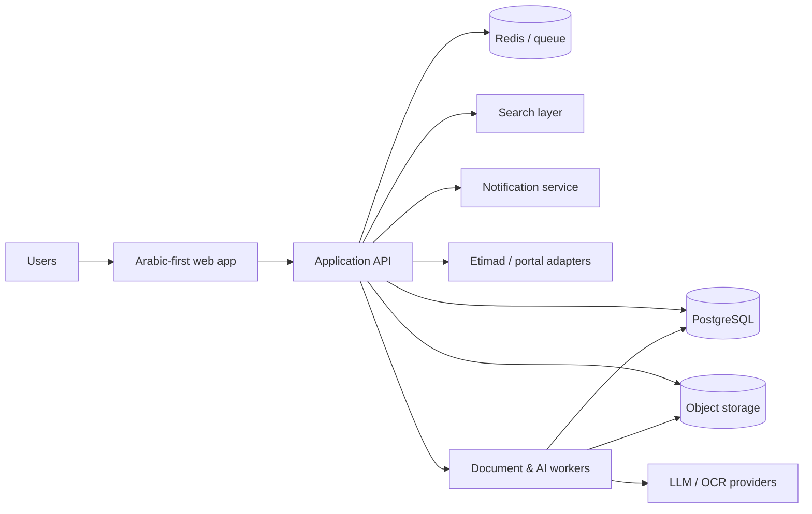

**Component responsibilities**

| Component | Responsibility |
|---|---|
| Web app | Dashboard, workspace, matrix, vault, admin |
| API | Auth, RBAC, orchestration, audit, business rules |
| Worker services | Parse, OCR, extraction, scoring, exports, reminders |
| PostgreSQL | Core transactional entities |
| Redis / queue | Async jobs, reminder scheduling, retries |
| Object storage | Raw documents, derived artifacts, export bundles |
| Search layer | Full-text and later hybrid search |
| Notification service | Email and optional WhatsApp delivery |
| Adapter layer | Controlled ingestion from Etimad-related sources and manual flows |

### Deployment topology

Saudi hosting matters. Google documents show access to the Dammam region through CNTXT, with sovereign-control options and local regulatory positioning; OCI publicly lists Riyadh and Jeddah regions; Microsoft’s geography page lists Saudi Arabia as an Azure geography with Saudi Arabia East on the region page; AWS public regional presence in MENA is Bahrain and UAE rather than Saudi-hosted public regions. For BidReady KSA, the most realistic early recommendation is **KSA-hosted primary production on Google Cloud Dammam or OCI Riyadh/Jeddah**, with the exact choice left open pending procurement route, service availability, and enterprise residency obligations. citeturn20view0turn20view4turn20view1turn20view2turn20view3

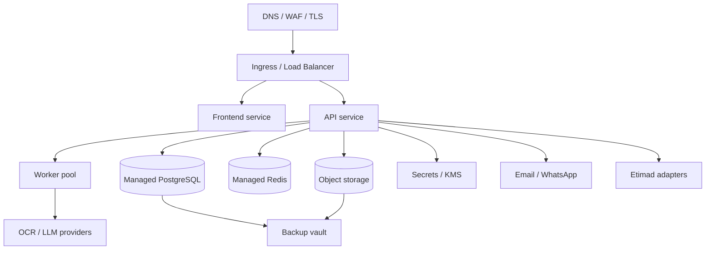

### AI pipeline

The architecture should be **AI-assisted, rules-governed, human-approved**.

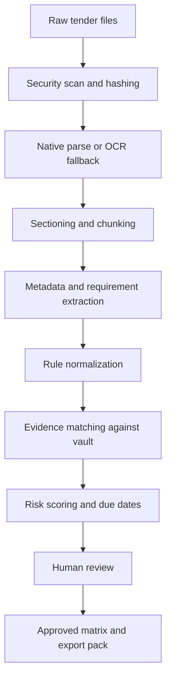

**Pipeline rules**

The LLM should extract, summarize, classify, and propose. It should **not** be the sole source of deterministic facts like official deadlines, doc expiry, access rights, or final submission authority. That split matches official privacy/compliance expectations and also reflects the strongest competitor positioning, which still keeps a human in the loop. citeturn19view0turn15view1turn15view2

### Data ingestion and parsing flows

#### Tender ingestion flow

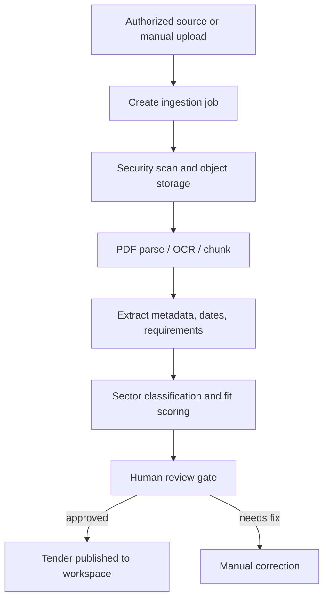

#### Compliance matrix generation

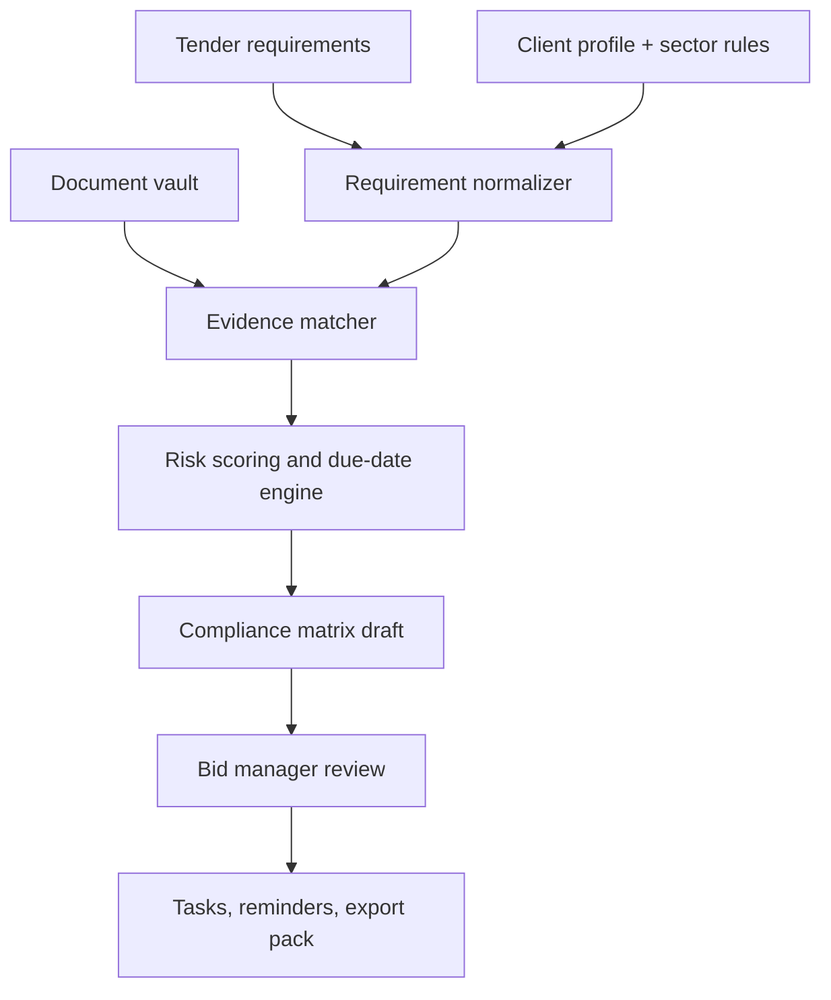

#### Document vault lifecycle

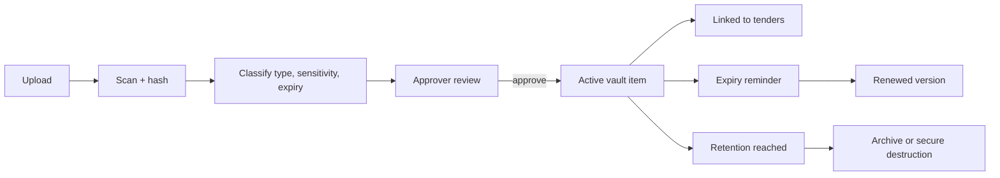

### Sequence diagrams

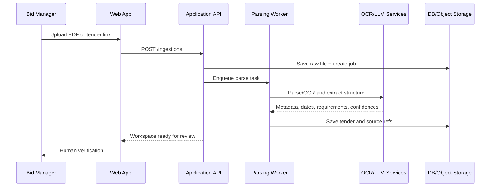

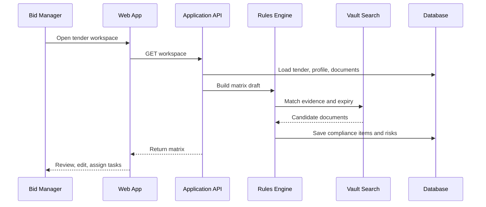

### Integration points

**Etimad**

Use progressive integration. Publicly documented Etimad materials support tender viewing, subscription, developer-portal onboarding, and at least one public contract-inquiry API product. Design adapters for:

- manual upload
- inbound customer-forwarded tender mail
- controlled link capture
- public/authorized metadata sync
- award/contract context where Contracts Plus is legitimately available

Do **not** make MVP viability depend on unpublished submission APIs. citeturn17view1turn17view6turn13view4

**Email**

Email should be first-class because tender notifications, clarifications, attachments, and internal reviews still travel through inboxes. Use inbound parsing plus outbound reminders and digests.

**WhatsApp**

WhatsApp is useful for operational reminders and urgent follow-up, not for deep evidence exchange by default. Official WhatsApp Business materials position the platform for sales, service, and customer engagement, with per-message pricing and policy controls. For BidReady, keep WhatsApp scoped to reminders, approvals, and deadline nudges after explicit opt-in and template governance. citeturn3search0turn3search11turn3search6turn3search2

### CI/CD, monitoring, backup, DR, and operational runbook

**CI/CD**

Use trunk-based development with protected main, automated tests, infrastructure-as-code, ephemeral review environments, and signed release artifacts. Promotion should be Dev → UAT → Prod with schema migration guardrails.

**Monitoring**

Use four layers:

- uptime and endpoint health
- application logs and tracing
- queue/job monitoring
- business ops alerts such as parse failure rate, export failure, reminder backlog, expiring-doc spike

**Backup and DR**

| Area | Minimum approach |
|---|---|
| Database | PITR-enabled managed backups |
| Object storage | Versioning plus replicated backup vault |
| Secrets | Central secret manager with rotation runbook |
| DR target | Warm-standby design for later phase; pilot can start with restore-based recovery |
| Recovery metrics | Target RPO ≤ 15 min; RTO ≤ 4 hr for pilot |

**Operational runbook**

| Event | First response |
|---|---|
| Parser spike in failures | Pause auto-publish, route jobs to review queue, inspect source-type drift |
| LLM/OCR outage | Degrade to queue/retry, expose status in UI, allow manual tender creation |
| Sensitive-doc access anomaly | Alert security owner, lock session, review audit trail |
| Expiry-reminder backlog | Re-run scheduler, dedupe sends, confirm queue health |
| Export failure before deadline | Trigger priority rebuild path and notify workspace owner |
| Suspected data breach | Start incident workflow, preserve evidence, assess notification threshold |

## Tooling choices and delivery plan

### Tool comparison tables

**PDF parsing**

| Option | Strength | Weakness | Practical cost view | Recommendation |
|---|---|---|---|---|
| PyMuPDF | Fast, mature, strong extraction/manipulation | Native-text strongest; OCR is separate | Low | **Primary parser** citeturn9search0 |
| pdfplumber | Good layout and table handling | Slower and more tactical than primary parser | Low | **Fallback for tricky layouts/tables** citeturn9search1 |
| Unstructured | Useful partitioning into semantic elements | More moving parts and heavier dependency chain | Medium | **Use for chunking/normalization, not as only parser** citeturn9search2 |

**OCR / document AI**

| Option | Strength | Weakness | Practical cost view | Recommendation |
|---|---|---|---|---|
| AWS Textract | Strong managed OCR/document extraction | Saudi data residency weaker for KSA-hosted default | Medium | Good fallback, not first KSA choice citeturn8search0 |
| Azure Document Intelligence | Mature document extraction product | Saudi-region service-by-service availability needs validation | Medium | Strong enterprise option if residency path clears citeturn8search1 |
| Google Document AI | Strong document AI and aligns with Dammam cloud path | Need region/procurement validation per customer setup | Medium | Strong option where GCP Dammam is primary citeturn8search2turn20view0turn20view4 |
| Tesseract | Free, local, sovereign-friendly | Lower quality on messy Arabic scans; more ops burden | Low | Use only as local fallback / low-sensitivity backup citeturn8search3 |

**LLM providers**

| Option | Strength | Weakness | Practical cost view | Recommendation |
|---|---|---|---|---|
| OpenAI API | Strong general extraction/synthesis, rich tooling | Residency/procurement path depends on deployment choice | Medium | **Primary default via provider abstraction** citeturn7search0 |
| Anthropic Claude | Strong long-context reasoning | Less convenient if cloud/procurement path is constrained | Medium | **Secondary / routing option** citeturn6search1 |
| Azure OpenAI | Enterprise procurement and Azure controls | Saudi-region specifics may still be open by service | Medium | Strong enterprise-managed path citeturn6search3turn20view2 |
| Google Gemini Enterprise | Good alignment if GCP Dammam chosen | Tooling/residency details depend on exact stack | Medium | Good alternative under GCP-first strategy citeturn6search17turn20view4 |

**Database and search**

| Option | Strength | Weakness | Practical cost view | Recommendation |
|---|---|---|---|---|
| PostgreSQL + FTS | Reliable core DB, built-in text search, lower complexity early | Search relevance ceiling lower at scale | Low | **Primary MVP choice** citeturn10search0turn11search0turn11search8 |
| OpenSearch | Strong scalable search and vector capabilities | More ops and tuning overhead | Medium | Add when corpus/search complexity justifies it citeturn10search1turn10search17 |
| Typesense | Easy, fast typo-tolerant search | Narrower ecosystem for deep analytics | Low–Medium | Reasonable lighter alternative for simple search UX citeturn10search2 |
| Elastic Cloud | Mature managed search | Usually higher cost/complexity for first phase | High | Not first recommendation for MVP citeturn10search3 |

**Hosting**

| Option | Strength | Weakness | Practical cost view | Recommendation |
|---|---|---|---|---|
| Google Cloud Dammam | KSA region, CNTXT route, sovereign controls positioning | Procurement/access model specific to KSA billing | Medium | **Best default for KSA-hosted SaaS if customer procurement fits** citeturn20view0turn20view4 |
| OCI Riyadh/Jeddah | Two Saudi regions publicly listed | AI/tooling path may be less convenient depending on stack | Medium | **Best alternative for stricter Saudi-region infrastructure preference** citeturn20view1 |
| Azure Saudi geography | Future-facing enterprise path | Exact service availability still needs validation | Medium | Keep open, especially for enterprise accounts citeturn20view2 |
| AWS Bahrain/UAE | Mature stack | Not Saudi-hosted public-region default | Medium | Not recommended as KSA-default residency option citeturn20view3 |

### Recommended stack

For MVP, the cleanest stack is:

- **Frontend:** Next.js
- **Backend:** NestJS / TypeScript
- **Worker services:** Python
- **Database:** PostgreSQL
- **Queue/cache:** Redis
- **Storage:** S3-compatible object store
- **Search:** PostgreSQL FTS first, OpenSearch later
- **PDF parsing:** PyMuPDF primary, pdfplumber fallback, Unstructured for partitioning
- **OCR:** managed cloud OCR chosen by residency/procurement path, with local fallback
- **LLM:** provider abstraction with OpenAI primary and at least one secondary route
- **Infra:** KSA-hosted production on GCP Dammam or OCI Riyadh/Jeddah
- **Notifications:** email first, WhatsApp optional

### Resource estimates

Exact team size is an open item, but the 12-week plan below assumes a lean core squad:

| Role | Approx. FTE |
|---|---|
| Product lead / founder | 1.0 |
| Full-stack lead | 1.0 |
| Python / document-AI engineer | 1.0 |
| DevOps / platform | 0.4 |
| QA / UAT | 0.5 |
| Arabic UX / content support | 0.3 |

### Milestones and Gantt chart

| Milestone | Outcome |
|---|---|
| Foundation | source map, backlog, UX direction, infra baseline |
| Core platform | auth, tenancy, tender intake, storage |
| Intelligence | parse/OCR pipeline, requirement extraction, scoring |
| Readiness engine | compliance matrix, vault, tasks, exports |
| Hardening | security controls, UAT, pilot onboarding, go-live |

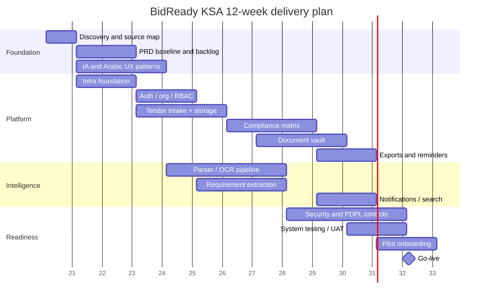

## Source list and open questions

### Selected source list

| Source | Use |
|---|---|
| Saudi MOF / Etimad procurement pages citeturn13view5turn17view1turn17view0turn17view4 | Official tender lifecycle, private-sector actions, portal behavior |
| Etimad Developer Portal / Contracts Plus citeturn17view6turn13view4 | Public developer onboarding and visible API product |
| SDAIA PDPL law and guidance citeturn17view2turn19view0turn19view1turn19view2turn19view3 | Privacy, records, breach, minimization, transfers, DPO |
| Local content regulations citeturn17view5 | Local-content and national-product implications |
| WhatsApp Business official docs citeturn3search0turn3search11turn3search6turn3search2 | Messaging strategy, pricing model, policy boundaries |
| Hosting-provider official docs citeturn20view0turn20view4turn20view1turn20view2turn20view3 | Saudi-region deployment choices |
| Competitor product pages citeturn14view2turn13view3turn15view1turn15view0turn15view2turn14view6 | Market shape, public feature and price anchors |
| Tooling docs and pricing pages citeturn9search0turn9search1turn9search2turn8search0turn8search1turn8search2turn7search0turn6search1turn6search3turn10search0turn11search0turn10search1turn10search2turn10search3 | Stack comparison and recommendation basis |

### Open questions and limitations

The highest-confidence product and architecture decisions are clear, but a few items remain open because they depend on customer procurement, residency tolerance, and commercial model:

- exact team size
- exact budget
- final cloud/provider selection
- depth of Etimad automation that will be contractually and technically available in practice
- whether enterprise/on-prem needs to exist at initial GA or can follow after managed pilots

The strongest recommendation, with current evidence, is to start with a **managed pilot version of BidReady KSA focused on tender intake, fit scoring, compliance matrix, document vault, and submission-readiness exports**, then expand into broader self-serve automation once those workflows are validated in live Saudi bidding teams.